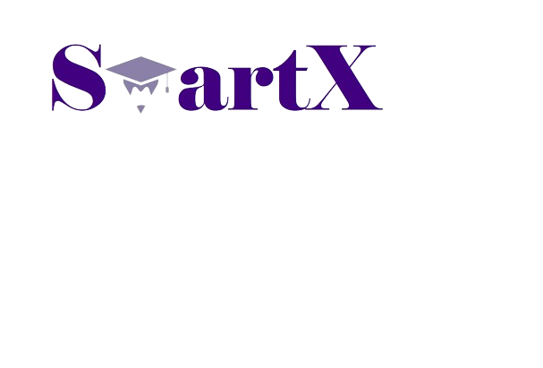

<h1 align="center">SmartX</h1>

  

 

    
    
    
    

## 📋 Description
We're a SmartX. The purpose of our application is to perform the programming tasks. 
## 🚀 Languages 
  
 
  
  

## 🔧 Tools 
  
 
  
    
    <a href="https://www.microsoft.com/en-us/microsoft-365/powerpoint">
    <a href="https://www.microsoft.com/en-us/microsoft-365/excel">
     
    
    </a>
  
 
  
## 💼 Documents
+ [Presentation](./documentation/Presentation.pptx)
+ [Documentation](./documentation/Documentation.docx)
+ [QA Documentation](./documentation/QA_documentation.ods)

## 👨🏻‍💻 Team Members
| **Name** | **Role** | **Grade** |
| :---:   | :---: | :---: |
| Veselina Varadeva| Scrum Trainer | 🟩 9V |
| Bilyana Badalova |  Back-end developer | 🟥 10B |
| Stela Georgieva |  Q&A  | 🟥 10B |
| Mariela Dimova | Back-end developer  | 🟦 10G |
| Teodora Skulieva |  Back-end developer  | 🟩 9V  |
| Gabriela Encheva |  Back-end developer  | 🟩 9V  |

